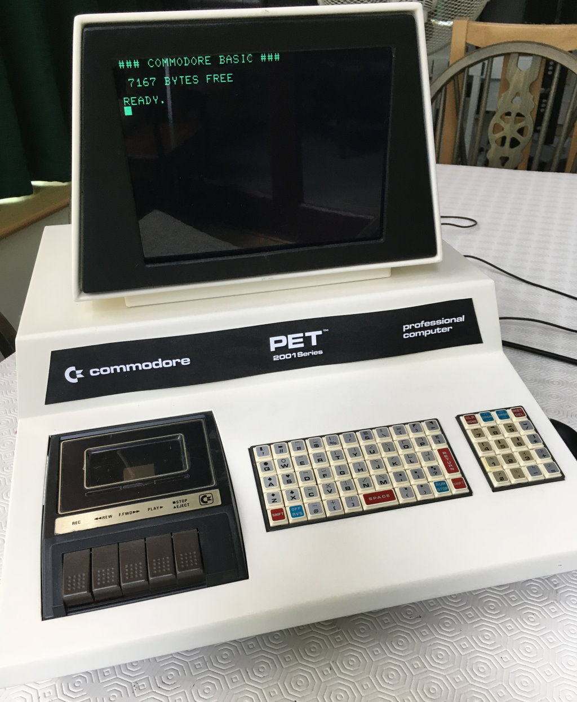
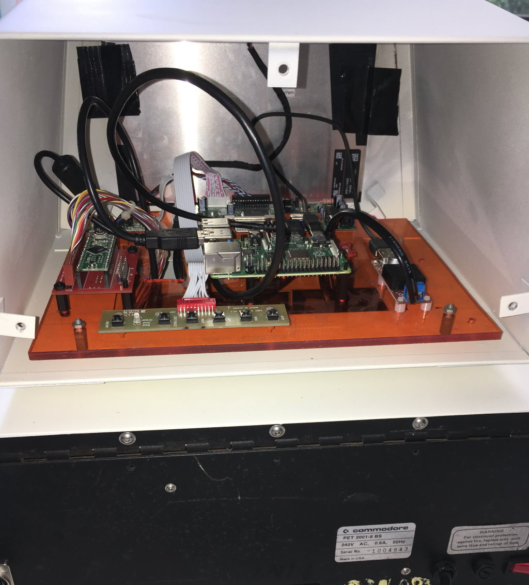

# Commodore Pet 2001 Javascript Emulator
## Introduction
This is an emulator of a Commodore Pet 2001 using Javascript running as an Electron JS app running on a Raspberry PI 4. The display is a 9.7 inch 1024x764 4:3 Apect ratio iPad screen with a custom controller. The keyboard is interfaced using a Teensy II.

The emulator software is 99% based on the original work of Thomas Skibo and further additions and enhancements by Norbert Landsteiner. Both have given permission to host my modifications along with their code here. (See links further down).

[Video](https://youtu.be/V2NT-i4VeAY) of the final (for the moment) machine.
## History
One of the first computers I ever used was a Commodore Pet 2001 with it's built in tape recorder 'datasette' and it's calculator style 'chiclet' keyboard. Being so unique it must have made an impression on me as I have always wanted to have one again.

Overtime I managed to aquire a couple of these machines and got one of them working although using it was always a mildly traumatic experience as the chances of something not working (at best) or catching fire (at worst) seemed around 50/50.

So a few years ago I put together an PET 2001 emulator based on RetroPi/MAME/Vice and other sources with the aim of making the second PET into  fake PET. It would look and function identically to the original but be based on modern tech. I got this working but the emulation wasnt 100% accurate and I never got round to building an easy to use interface to allow the loading of programs. 

Fast forward to present day and I was looking for lockdown (time of writing July 2020) things to do and idly glancing at my fake PET and my real PET (broken again) and I thought about the online PET emulator I had seen by Thomas Skibo and wondered 'could I build that into my Fake PET?'.

The answer is yes and it was surprisingly easy.

# What it took
## Software
The first step was to see how a browser based JavaScript application could be run locally and disconnected from the web. One way I guessed was to run an Apache or Nginx web server on the Raspberry Pi and have the online files hosted locally and use some kiosk techniques to get it all to work. 

However, this seemed like a lot of effort and would require different environments for development (I mostly work in Windows) and the target Raspberry PI.

Luckily, I almost immediately came across [Electron JS](https://www.electronjs.org/).

Electron JS allows you to run any? Javascript app/code as if it is a native application of the OS you are using. It does this by bundling a version of the Chromium web browser in with it's executable and seemlessly launching it as a windowed app of whatever OS/Gui you are using. It's cross platform so will run on Windows, Linux Mac etc..

Having found this within a couple of hours I had the online version of the PET emuator running as a windowed app on my Windows 10 PC and with an hour more I had the same thing running on Raspian Buster on the Raspberry PI 4.

This proved that my aim was feasable so now it just became a case of trying to make the whole experience as seamless as possible and as close to that of a real PET 2001 as possible. (This was WAY harder and still has some way to go).

## Keyboard
The PET 2001 keyboard is a vey simple matrix and the controller is provided using a Teensy II which is basically an Arduino. The INO I use can be found in the keyboard folder.

### Raspberry PI build
The build of the Raspberry PI 4 Raspian Buster OS has been the most time consuming aspect of this build. It probably took 3-4 days of time to get Electron JS running on Raspian Lite with a minimal XOrg config. It's still not perfect as I get a few screen res changes and flashes and it takes longer than I would like to get into the emulation (approx 24 secs).

## Sources
Thomas and Norberts work can be viewed online at the following links...

- [Thomas's original Commodore PET 2001 emulator](https://www.skibo.net/6502/pet2001/)
- [Norberts enhanced Commodore PET 2001 emulator](https://www.masswerk.at/pet/)

## Other notes
- If you want to run this on your Windows/Mac/Linux machine then you'll need to follow the guide on the Electron JS website. Basically install Node/NPM then Electron JS, clone/download this repo and then from the root folder npm init nd npm install. Finally run npm start from the command line and it should work.
- PET PRG files are not included in the repo. See Norberts online version for a start on were to find them (hint: click the PRG Library button).
- On the Raspberry PI the mouse pointer disapears when the OS file select box is displayed. I have no idea how to fix this.
- On the Raspberry PI 4 running Raspian Buster Lite and a minimal XOrg this is using about 50% CPU. It doesnt seem to be using acceleration although with my first experiments with full Raspian Desktop I'm pretty sure it did and used only about 35% CPU. Xorg is hard.
